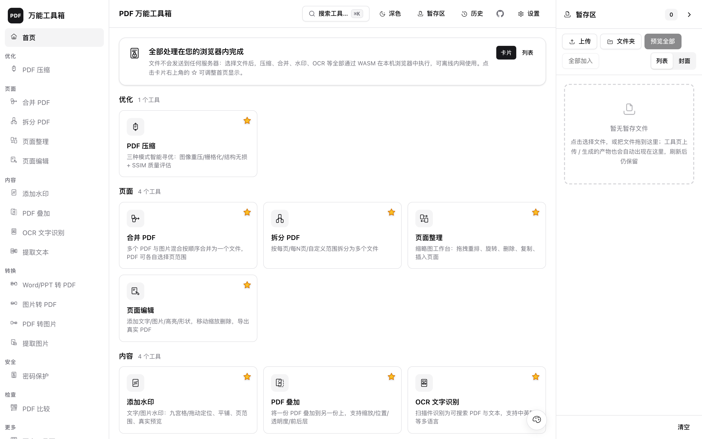
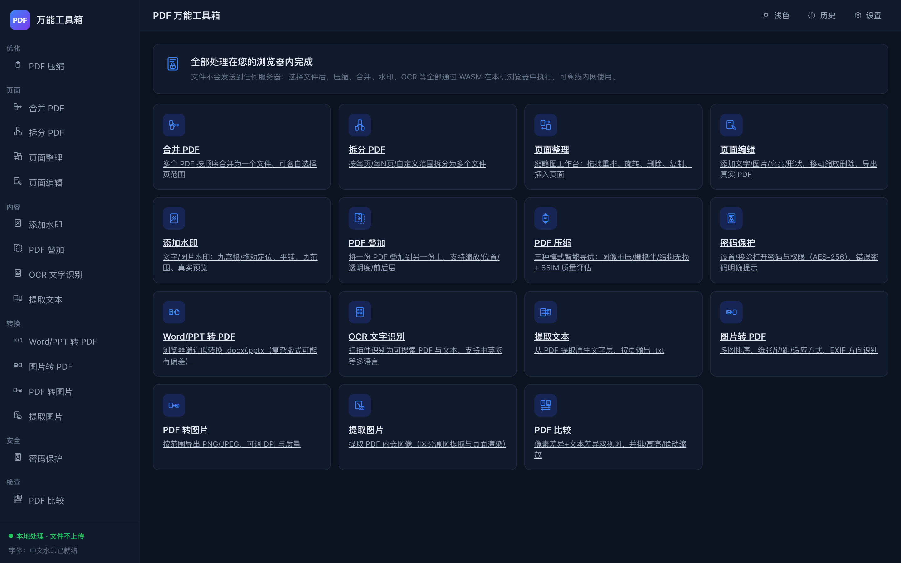
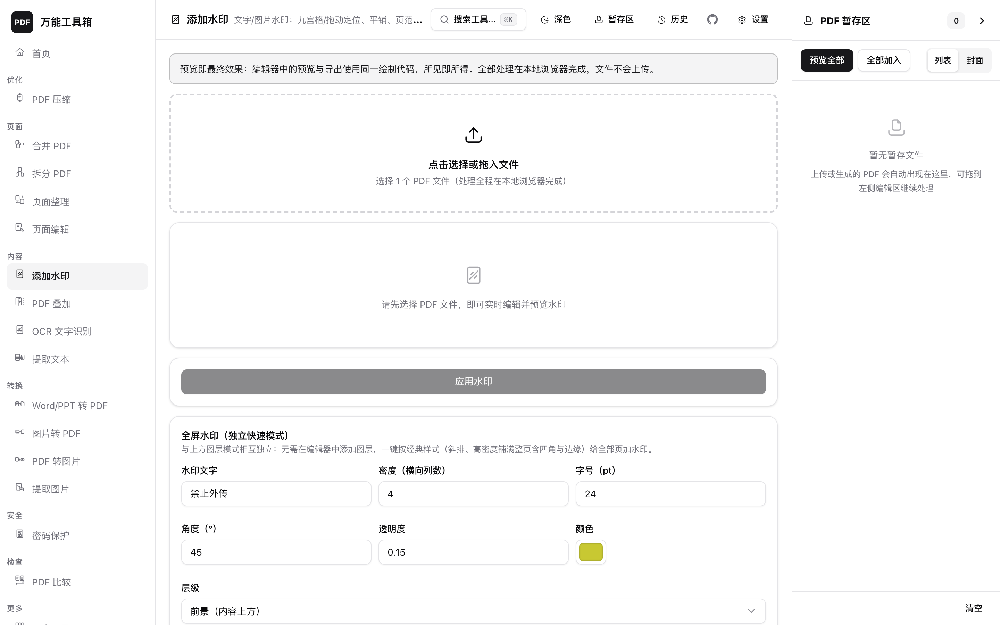

# PDF 万能工具箱（纯浏览器端 PDF 工具）

一个**纯前端**的 PDF 万能工具箱：15 个核心工具 + 48 个「更多」工具，所有文件处理都在你的浏览器内通过 WebAssembly/JS 完成，
**文件字节绝不发送到任何服务器**。部署方只需提供静态资源服务，服务器上不留任何用户文件。

[](https://vercel.com/new/clone?repository-url=https%3A%2F%2Fgithub.com%2FSam5440%2Fpdf-toolkit&project-name=pdf-toolkit)





## 隐私与安全模型

- **文件不出浏览器**：合并、拆分、水印、压缩、OCR、加密……全部在浏览器内的
  WASM/JS 引擎（pdf-lib、pdf.js、mupdf-wasm、Tesseract.js）中完成；后台仅为静态站点。
- **密码不落盘**：密码仅存在于当前标签页内存，用于处理后即丢弃；不写入
  localStorage / IndexedDB / 历史记录 / 网络（历史记录保存前会剔除含
  pass/password/secret/token 字样的选项键）。
- **历史记录在本地**：处理历史与输出文件引用保存在浏览器 IndexedDB（有配额管理），
  可随时在「历史」页删除或清空；清除浏览器数据即彻底清除。
- **断网可用**：除首次加载页面资源外，处理过程不需要网络（OCR 语言包、中文字体均随站点本地分发）。
  已通过严格断网 e2e（拦截全部网络请求）验证：SPA 内导航与真实文件处理零请求。

## 功能总览（15 个核心工具）

| 分组 | 工具 | 说明 |
|---|---|---|
| 优化 | PDF 压缩 | 三种模式寻优：智能图像重压 / 栅格化重建 / 结构无损；目标体积 + SSIM 质量评估 + 候选列表与推荐 |
| 页面 | 合并 PDF | 多文件按顺序合并，可各自选择页范围 |
| 页面 | 拆分 PDF | 按每 N 页 / 自定义范围拆分，ZIP 批量下载 |
| 页面 | 页面整理 | 缩略图工作台：拖拽重排、旋转、删除、复制、插入空白页、撤销重做 |
| 页面 | 页面编辑 | 添加文字/图片/形状（高亮/矩形/椭圆），拖动缩放删除，导出真实 PDF |
| 内容 | 添加水印 | 文字/图片多图层、九宫格+自由拖动+精确坐标、平铺/错列/**全屏铺满**、前景/背景、页范围与模板变量、预设保存与导入导出、CJK 字体内嵌；**预览与导出走同一绘制代码** |
| 内容 | PDF 叠加 | 底稿×覆盖稿逐页配对，缩放/位置/透明度/前后层 |
| 内容 | OCR 文字识别 | Tesseract.js 本地识别（简/繁/英，可多选），输出可搜索 PDF（图像页+不可见文字层）与 .txt；扫描页自动回退 |
| 内容 | 提取文本 | 按页范围提取原生文字为 .txt |
| 转换 | Word/PPT 转 PDF | 浏览器端**近似转换**（见下方限制） |
| 转换 | 图片转 PDF | 多图排序、纸张/边距/适应方式、EXIF 方向识别 |
| 转换 | PDF 转图片 | 按范围导出 PNG/JPEG，可调 DPI 与质量 |
| 转换 | 提取图片 | 提取 PDF 内嵌图像（区分原图提取与页面渲染，SMask 透明合成） |
| 安全 | 密码保护 | AES-256 打开密码 + 权限控制；凭密码解锁移除；错误密码明确反馈 |
| 检查 | PDF 比较 | 逐页像素差异（阈值可控）+ 文本行级 diff，并排/叠加/差异高亮/联动缩放，报告导出 |

### 水印工具页一览



## 更多工具（48 个，对齐 PDF24）

在 15 个核心工具之外，另有一组「更多」工具，集中在**「更多工具页」**（侧边栏「更多 → 更多工具页」，
或首页底部入口）。**收藏系统**：首页只显示已收藏的工具（默认 = 15 个核心工具），每张卡片右上角
有 ★ 星标——白色为未收藏、黄色为已收藏，点击即收藏/取消并保存在本机浏览器；「更多工具页」按
9 个功能分类展示全部扩展工具（核心工具也列在页尾目录，方便随时调整收藏），首页与专项页均按
分类分区显示。设置里可一键恢复默认收藏。与 PDF24（tools.pdf24.org/zh）的完整功能对照见
[docs/pdf24-comparison.md](docs/pdf24-comparison.md)。

| 分类 | 工具 |
|---|---|
| 页面 | 旋转 PDF · 删除 PDF 页面 · 提取 PDF 页面 · 每页页面数（2/4/6/9/16 合 1）· 页面切半 · 裁剪 PDF · 更改页面大小 · 添加页码 · 添加书签 |
| 信息与安全 | 修改文档信息 · 移除元数据 · 查看器偏好 · PDF 涂黑（真删除文字）· PDF 签署 · 填写 PDF 表单 · 创建可填写表单 · 密码生成器 |
| 优化与修复 | 扁平化 PDF（表单/栅格双模式）· 栅格化 PDF · 修复 PDF |
| 查看与检查 | PDF 查看器 · PDF 搜索 |
| 创建与转换 | 生成 PDF · 文本/Markdown/RTF/EPUB/ODF/Excel/SVG/TIFF/HEIC 转 PDF · 网页转 PDF · 扫描件转 PDF · 发票生成 |
| 图像与导出 | WebP/HEIC 转 JPG/PNG · 生成二维码 · PDF 转 Word/PPT/Excel/HTML/Markdown/RTF/EPUB/ODF/TIFF/SVG |

> **Markdown 转 PDF（在线编辑 + 实时预览，默认收藏）**：支持直接在编辑器里撰写/粘贴，
> 上传的 .md 也会载入编辑器可继续修改；预览区实时显示最终 PDF 页面（所见即所得）。
> 内容与参数自动暂存本机（刷新不丢）。渲染支持 KaTeX 数学公式（行内 `$…$` / 独立
> `$$…$$`）、Mermaid 图形（```mermaid 代码块）、思维导图（```mindmap 代码块），
> 全部离线 bundle 渲染后嵌入 PDF，无需联网。该工具已默认收藏到首页（可在设置恢复）。
>
> **输出为文本型 PDF**：标题/正文/列表/表格/代码为嵌入字体的真实文字——可框选、
> 可搜索、可复制（内嵌 Noto Sans SC，GB2312 全量字库）；公式与图形以高分辨率图片
> 混排。文本转 PDF、生成 PDF、RTF/EPUB/ODF/Excel 转 PDF 等全部文本类工具同样输出
> 文本型 PDF。字库再生成见 `scripts/build_text_fonts.py`。

## 界面图标

界面图标默认使用 27 个按统一规范手工绘制的单色线描 SVG（`src/assets/icons/`，
viewBox 48、2.5 线宽、currentColor 随主题）。设置页提供「图标方案」切换：
**手绘线描 SVG（默认）** / **原版 emoji**，偏好保存在本机浏览器。
规范见 [docs/ICON-GUIDELINES.md](docs/ICON-GUIDELINES.md)。

## 快速开始

```bash
npm install
npm run dev          # 开发（Vite）
npm run build        # 产出纯静态 dist/
python3 scripts/serve.py dist 8137   # 本地预览（也可用任意静态服务器）
./start.sh           # 一键启动已构建站点并打开浏览器（默认 8137，被占用自动顺延）
```

macOS 可双击 `启动PDF工具箱.command`；旧版命令行压缩工具用 `启动PDF寻优工具.command`。

首次构建前需下载运行资产（约 40 MB：中文字体、OCR 语言包、pdf.js 资源）：

```bash
python3 scripts/fetch_assets.py
bash scripts/build_fonts.sh   # 可选：从 Google Fonts 可变字体生成中文字体子集
```

## 部署（任意静态托管）

### Vercel 一键部署

[](https://vercel.com/new/clone?repository-url=https%3A%2F%2Fgithub.com%2FSam5440%2Fpdf-toolkit&project-name=pdf-toolkit)

点击按钮 → 用 GitHub 账号授权 → 确认即可。Vercel 会自动识别 Vite 项目（`npm run build` → `dist/`），
无需配置任何环境变量；`.wasm` / `.ttf` 等静态资源自带正确 MIME。

### 其他托管

`dist/` 是纯静态站点，支持子目录部署（相对路径 base）。注意为以下类型配置正确 MIME：

- `.wasm` → `application/wasm`（mupdf/pdf.js 引擎与 Tesseract）
- `.ttf` → `font/ttf`（Noto Sans SC 子集）
- `.traineddata` → `application/octet-stream`（OCR 语言包）
- `.mjs` → `application/javascript`（pdf.js worker）

nginx 参考：

```nginx
location /pdftool/ {
    alias /var/www/pdftool/dist/;
    types {
        application/wasm wasm;
        font/ttf ttf;
        application/octet-stream traineddata;
        text/html html; text/css css;
        application/javascript js mjs;
        image/png png; image/svg+xml svg;
    }
}
```

Caddy 更简单：静态文件服务默认带正确 MIME，直接 `pdftool.example.com { root * /var/www/pdftool/dist; file_server }`。

## 项目结构

```
压缩PDF/
  index.html + src/            Vite + 原生 ES modules（无框架）
    core/                      引擎 worker（全部 PDF 操作在 Web Worker 执行）
                               几何/页范围/模板/SSIM/diff 纯逻辑模块，
                               documents/history(IndexedDB)/fonts/files/download/zip
    components/                上传面板/页面工作台/水印编辑器/比较视图/UI 基件/SVG 图标装载器
    tools/                     15 个工具控制器（每工具独立文件）+ 注册表
    assets/icons/              27 个手绘 SVG 图标（构建期内联）
  public/fonts/                中文字体子集（水印/编辑用，构建期生成）
  public/tessdata/             Tesseract 语言包（本地分发，处理不联网）
  public/pdfjs/                pdf.js cmaps 与 standard fonts
  scripts/                     构建/服务/测试/图标脚本（serve.py、fetch_assets.py 等）
  tests/                       unit(vitest) / e2e(Playwright) / verify(pytest 独立校验)
  pdf_optimizer.py             旧版 Python 压缩工具（独立保留可用）
```

## 测试

```bash
bash scripts/run_tests.sh
```

三层架构（详见 [tests/README.md](tests/README.md)）：

1. **vitest 单元测试**：页范围/几何/平铺与全屏布局/模板变量/SSIM/文本 diff 等；
2. **Playwright 真实浏览器 e2e**：15 个工具的成功与关键失败链路 + 严格断网套件
   （真实 filechooser 上传、真实下载捕获，禁止 DOM 注入伪造）；
3. **pytest 独立校验**：pypdf / PyMuPDF / Pillow 用不同引擎交叉验证浏览器产物
   （页数/顺序/加密/文字层/图像像素），「浏览器生产、Python 独立验证」。

另保留旧版压缩工具 `pdf_optimizer.py` 及其回归测试。

## 能力与限制（如实说明）

| 能力 | 现状与限制 |
|---|---|
| Office 转 PDF | **近似转换**：浏览器端渲染（docx-preview/pptx-preview）→ 图像 → PDF。复杂排版（页眉页脚、复杂表格、图表、艺术字）保真度有限；产物为页面图像、文字不可选中。需要高保真请用 Office/WPS 导出 PDF。界面内有醒目警告 |
| 旧版 .doc / .ppt | 浏览器无法解析旧二进制格式，**不支持**；请先另存为 .docx / .pptx（界面会明确提示） |
| 栅格化压缩 | 整页转为图像：文字不可选中、可放大查看但非矢量 |
| 加密密码 | 引擎限制：密码不能包含英文逗号 `,` 与等号 `=`；密码丢失无法找回（无后门，这同样是隐私保证） |
| 提取嵌入图像 | 输出的是 PDF 内嵌的原始图像（与「页面截图」不同）；CMYK 图像做近似 RGB 转换 |
| 大文件 | 浏览器内存受限。上传体积、渲染像素有可配置上限（设置弹窗），超限会警告或拒绝 |
| 水印/编辑 | 页面级编辑：添加/移动/删除所添加的内容，不修改既有段落文字；中文水印文字以高分辨率位图嵌入（规避浏览器引擎 CJK 字体内嵌缺陷，视觉无损、文字层不可选中） |

## 旧版工具

`pdf_optimizer.py`（Python 版 PDF 体积寻优）保留可用：
`python3 pdf_optimizer.py --cli 文件.pdf --target 20`（详见 `python3 pdf_optimizer.py --help`）。
新版浏览器工具箱与其互相独立。

## 许可证

[MIT](LICENSE)
